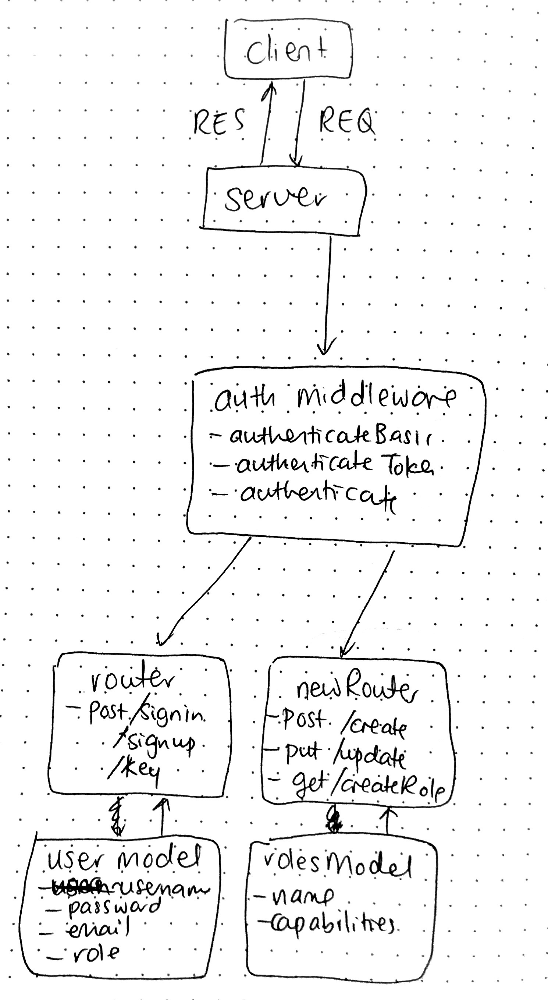

# LAB - 18

## ACL

### Author: Joanna Arroyo

### Links and Resources
* [submission PR](https://github.com/joanna-401-advanced-javascript/lab-18-acl/pull/1)
* [travis](https://travis-ci.com/joanna-401-advanced-javascript/lab-18-acl)

### Modules
#### `app.js`
#### `router.js`
#### `newRouter.js`
#### `user.js`
#### `role.js`
#### `article.js`
#### `auth.js`
#### `google.js`
#### `404.js`
#### `500.js`

##### Exported Values and Methods
###### `authenticateBasic(auth) -> object`
###### `authenticateToken(auth) -> object`

### Setup
#### `.env` requirements
* `PORT` - Port Number
* `MONGODB_URI` - URL to the running mongo instance/db
* `SINGLE_USE_TOKEN` - Indicates token generated is single use only
* `TOKEN_LIFETIME` - How long each token lasts for
* `SECRET` - Secret string used for encoding
* `GOOGLE_CLIENT_ID`
* `GOOGLE_CLIENT_SECRET`

#### Running the app
* `npm start`
* Endpoint: `/signup`
  * Returns a token
* Endpoint: `/signin`
  * Returns a token
* Endpoint: `/key`
  * Returns a key that doesn't expire
* Endpoint: `/oauth`
* Endpoint: `/create-roles`
  * Creates roles that can be assigned to users
* Endpoint: `/create-a-thing`
  * Users with create capabilities can create something
* Endpoint: `/update`
  * Users with update capabilities can update something
   
#### Tests
* Unit tests: `npm run test`
* Lint tests: `npm run lint`

#### UML
